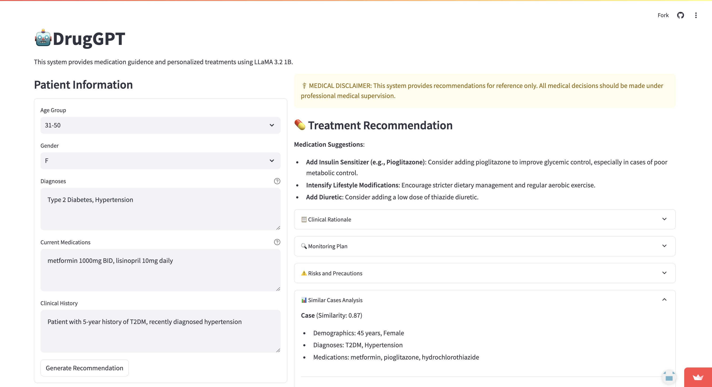
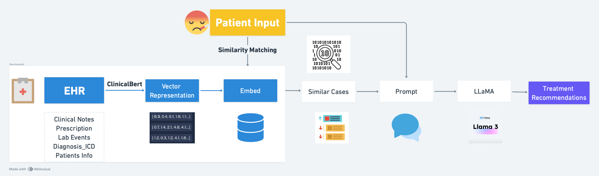

# DrugGPT💊: Drug Guidance and Personalized Treatment Recommendations Agent

DrugGPT is an AI-powered system designed to assist clinicians and patients by providing personalized treatment recommendations using Large Language Models (LLM) and retrieval-augmented generation (RAG) architecture. The system emphasizes privacy protection, evidence-based recommendations, and efficient deployment.




## Features

- **Privacy-First Architecture**: Utilizes RAG to protect patient data by converting sensitive clinical information into embeddings before LLM interaction
- **Evidence-Based Recommendations**: Integrates similar historical cases to provide treatment suggestions with transparent reasoning
- **Efficient Deployment**: Uses small and open-source LLaMA-3.2 1B model for fast response times and privacy assurance *[Update: We changed to llama-7B]*
- **User-Friendly Interface**: Built with Streamlit for easy interaction and clear presentation of recommendations

## Project Structure

```
.
├── .devcontainer/     # Development container configuration
├── app/               # Application demo files
├── data/              # The MIMIC dataset is not public accessible
├── scripts/           # Utility scripts
└── src/               # Source codepoint, modules
```

## Technical Architecture


### Model Components

- **Base Model**: LLaMA-3.2-1B/7B for reasoning and medical domain tasks
- **Embeddings**: ClinicalBERT for medical text understanding
- **Vector Database**: FAISS for efficient similarity retrieval
- **Framework**: Streamlit for web interface

### Data Processing

The system uses the MIMIC-III dataset (46,520 ICU patients) with the following preprocessing steps:
1. Text standardization
2. Key element extraction (diagnoses, medications)
3. Data structuring and unification
4. Train-test split (97% train, 3% test)

## Getting Started

### Prerequisites
- Permission of MIMIC dataset
- Python 3.x
- FAISS
- Streamlit
- LLaMA model
- ClinicalBERT

### Installation

1. Clone the repository:
```bash
git clone https://github.com/yourusername/DrugGPT.git
cd DrugGPT
```

2. Install dependencies:
```bash
pip install -r requirements.txt
```

3. Run the application:
```bash
python app.py
```

## Usage

The system accepts the following patient information:
- Age Group
- Gender
- Diagnosis
- Current Medications
- Clinical History

After submission, the system provides:
1. Medication suggestions with rationale
2. Monitoring recommendations
3. Similar cases analysis for reference

## Future Development

### Planned Improvements

- Fine-tuning LLaMA-3.2 1B
- Migration to LLaMA-2 7B
- Enhanced similarity scoring
- System validation with clinician feedback

### Evaluation Metrics

- **Baseline**: Zero-shot prompt comparison with other LLMs
- **Test Dataset**: 3% of MIMIC-III data (approximately 100 patients)
- **Performance Metrics**:
  - Correctness against established medical guidelines
  - Computational cost analysis
  - Token usage efficiency

## License

This project is licensed under the [LICENSE](LICENSE) file in the repository.

## Authors

- Yuning Zheng @[Igemirecle](https://github.com/igemiracle)
- Mercury Liu @[Europix](https://github.com/Europix)

## Acknowledgments

Carnegie Mellon University - School of Computer Science
